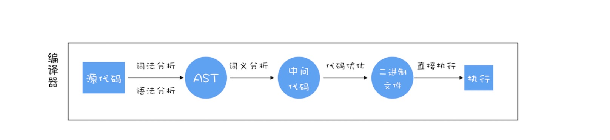
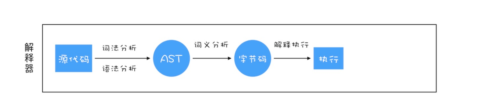
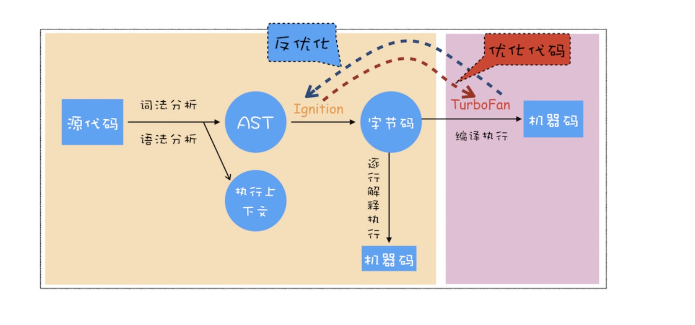
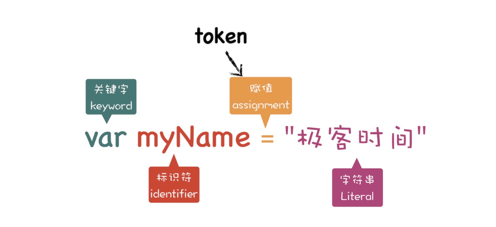

title: 浏览器工作原理与实践--- V8 工作原理应知
---

# V8 工作原理
## 编译器（Ignition）和解释器（TurboFan）  
>之所以存在编译器和解释器，是因为机器不能直接理解我们所写的代码，所以在执行程序之前，需要将我们所写的代码“翻译”成机器能读懂的机器语言。按语言的执行流程，可以把语言划分为编译型语言和解释型语言。
**编译型语言：** 在程序执行之前，需要经过编译器的编译过程，并且编译之后会直接保留机器能读懂的二进制文件，这样每次运行程序时，都可以直接运行该二进制文件，而不需要每次重新编译。比如 C/C++、 GO等。  

**解释型语言：** 在每次运行程序的时候都需要通过解释器对程序进行动态解释和执行。比如Python、JavaScript。  

## V8 如何执行一段 JavaScript 代码

1、生成`抽象语法树（AST）` 和`执行上下文`
>AST 是非常重要的一种数据结构，在很多项目中有着广泛的应用。其中最著名的一个项目是 Babel。Babel 是一个被广泛使用的代码转码器，可以将 ES6 代码转为 ES5 代码，这意味着你可以现在就用 ES6 编写程序，而不用担心现有环境是否支持 ES6。Babel 的工作原理就是先将 ES6 源码转换为 AST，然后再将 ES6 语法的 AST 转换为 ES5 语法的 AST，最后利用 ES5 的 AST 生成 JavaScript 源代码。  
**如何生成 AST**
* 第一阶段是`分词（tokenize）`，又称词法分析，作用是将一行行的源码拆解成一个个token（token，指的是语法上不可能再分的、最小的单个字符或字符串）。
  
* 第二阶段是`解析（parse）`,又称语法分析，作用是将上一步生成的 token 数据，根据语法规则转化为 AST。  
2、生成`字节码`  
**什么是字节码**  
>字节码就是介于 AST 和 机器码之间的一种代码。但是与特定类型的机器码无关，字节码需要通过解释器将其转化为机器码才能执行。（使用字节码可以减少系统的内存使用。）  
3、执行代码  
通常，如果有一段第一次执行的字节码，解释器 Ignition 会逐条解释执行。在执行字节码的过程中，如果发现有`热点代码（HotSpot）`，比如一段代码被重复执行多次，这种就称为`热点代码`，那么后台的编译器 TurboFan 就会把该段热点的字节码编译为高效的机器码，然后当再次执行这段被优化的代码时，只需要执行编译后的机器码就可以了，这样就大大提升了代码的执行效率。
>即时编译（JIT）：字节码配合解释器和编译器

## JavaScript 的性能优化
1、提升单次脚本的执行速度，避免 JavaScript 的长任务霸占主线程，这样可以使得页面快速响应交互。  
2、避免大的内联脚本，因为在解析 HTML 的过程中，解析和编译也会占用主线程。
3、减少 JavaScript 文件的容量，因为更小的文件会提升下载速度，并且占用更低的内存。

