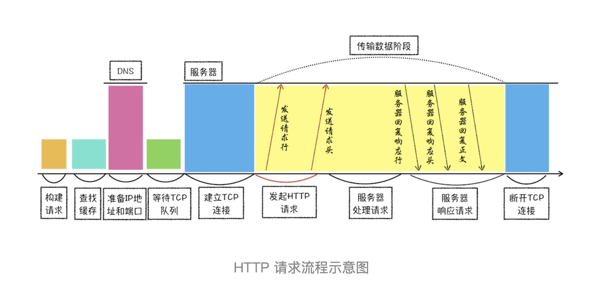

# 经典题目  （持续更新）
## http 请求流程？
1、浏览器构建请求行信息（如下所示），构建好后，浏览器准备发起网络请求。如下：
`GET /index.html HTTP1.1`  
2、查找缓存  
在发起真正请求之前，浏览器会先在浏览器缓存中查询是否有要请求的文件。
> 浏览器缓存是一种在本地保存资源副本，以供下次请求时直接使用的技术。  
当浏览器发现请求的资源已经在浏览器缓存中存有副本，它会拦截请求，返回该资源的副本，并直接结束请求，而不会再去源服务器重新下载。这样做的好处有：

a、缓解服务器端压力，提升性能（获取资源的耗时更短了）；
b、对于网站来说，缓存是实现快速资源加载的重要组成部分。  
3、准备 IP 地址和端口  
HTTP 和 TCP 的关系：  
浏览器使用 `HTTP` 协议作为应用层协议，用来封装请求的文本信息；并使用 `TCP/IP` 作传输层协议将它发到网络上，所以在 HTTP 工作开始之前，浏览器需要通过 `TCP` 与服务器建立连接。也就是说 `HTTP 的内容是通过 TCP 的传输数据阶段来实现的`。
`DNS（Domain Name System）`： 域名系统，负责把域名和IP一一映射。  
在这一步，浏览器会请求 DNS 返回域名对应的 IP。当然浏览器还提供了DNS 数据缓存服务，如果某个域名已经解析过了，那么浏览器会缓存解析的结果，以供下次查询时直接使用，这样也会减少一次网络请求。  
拿到 IP 之后，接下来就需要获取端口号了。通常情况下，如果 URL 没有特别指明端口号，那么 HTTP 协议默认是 80 端口。  
4、等待 TCP 队列  
Chrome 有个机制，同一个域名同时最多只能建立 6 个 TCP 连接，如果在同一个域名下同时有 10 个请求发生，那么其中 4 个请求会进入排队等待状态，直至进行中的请求完成。如果当前请求数量少于 6，会直接进入下一步，建立 TCP 连接。  
5、建立 TCP 连接 
6、发送 HTTP 请求  
一旦建立了 TCP 连接，浏览器就可以和服务器进行通信了。而 HTTP 中的数据正是在这个通信过程中传输的。
首先浏览器会向服务器发送请求行，它包括了请求方法、请求 URI（Uniform Resource Identifier）和 HTTP 版本协议。
7、服务器端处理 HTTP 请求流程
a、返回请求  
b、断开连接：关闭 TCP 连接。如果在 请求头信息加入 `Connection:Keep-Alive `,TCP 连接在发送后将仍然保持打开状态，这样浏览器就可以继续通过同一个 TCP 连接发送请求。
* 保持 TCP 连接可以省去下次请求时需要建立连接的时间，提升资源加载速度。  
8、重定向 ： 响应行返回定的返回码是301，就是告诉浏览器需要重定向到另外一个网址。  

### 补充知识点 
1、网络协议   
名称 |           层次 |              功能 
------------ | -------------| ------------- 
物理层 |   1 |  实现计算机系统与网络间的物理连接 
数据链路层 |  2  |    进行数据打包与解包，形成信息帧 
网络层    |    3  |  提供数据通过的路由
传输层    |     4    | 提供传输顺序信息与响应
会话层    |     5  |    建立和中止连接
表示层    |       6     |  数据转换、确认数据格式
应用层   |       7           |    提供用户程序接口  
  
2、为什么很多站点第二次打开速度会很快？ 
如果第二次页面打开很快，主要原因是第一次加载页面过程中，缓存了一些耗时的数据。  
被缓存的数据一般是：DNS 缓存和页面资源缓存。
浏览器通过响应头的 Cache-Control 字段来设置是否缓存该资源。缓存时长通过 Cache-Control 中的 Max-age 参数来设置的。  
这也就意味着，在该缓存资源还未过期的情况下, 如果再次请求该资源，会直接返回缓存中的资源给浏览器。

但如果缓存过期了，浏览器则会继续发起网络请求，并且在HTTP 请求头中带上：`If-None-Match:"4f80f-13c-3a1xb12a"`。  
服务器收到请求头后，会根据 If-None-Match 的值来判断请求的资源是否有更新。
a、如果没有更新，就返回 304 状态码，相当于服务器告诉浏览器：“这个缓存可以继续使用，这次就不重复发送数据给你了。”
b、如果资源有更新，服务器就直接返回最新资源给浏览器。  
## 浏览器刷新操作，ctrl+F5和F5有什么区别  
ctrl+F5是强制刷新，也就是资源都走网络。

F5是正常处理流程。

比如通过网络面板，打开一个站点，再使用强制刷新，可以看到如下信息
176 requests
3.1 MB transferred
3.5 MB resources
Finish: 26.30 s
DOMContentLoaded: 5.04 s
Load: 14.88 s

如果使用正常的刷新，看到的信息如下：
171 requests
419 KB transferred
3.2 MB resources
Finish: 25.09 s
DOMContentLoaded: 1.41 s
Load: 6.24 s

其中的transferred是真正的网络传输的数据，使用强制刷新，传输的数据体积就大多了，而且请求时间也变得更长了。

## 从输入URL到页面展示，这中间发生了什么？
  
* 首先，用户从浏览器进程里输入请求信息： 当用户在地址栏中输入一个查询关键字时，地址栏会判断输入的关键字是搜索内容，还是请求的 URL。 
  
* 然后，网络进程发起 URL 请求：浏览器进程会通过进程间通信（IPC）把 URL 请求发送至网络进程，网络进程接收到 URL 请求后，会在这里发起真正的 URL 请求流程。
>首先，网络进程会查找本地缓存是否缓存了该资源。如果有缓存资源，那么直接返回资源给浏览器进程；如果在缓存中没有查找到资源，那么直接进入网络请求流程。这请求前的第一步是要进行 DNS 解析，以获取请求域名的服务器 IP 地址。如果请求协议是 HTTPS，那么还需要建立 TLS 连接。  

>接下来就是利用 IP 地址和服务器建立 TCP 连接。连接建立之后，浏览器端会构建请求行、请求头等信息，并把和该域名相关的 Cookie 等数据附加到请求头中，然后向服务器发送构建的请求信息。  

>服务器接收到请求信息后，会根据请求信息生成响应数据（包括响应行、响应头和响应体等信息），并发给网络进程。等网络进程接收了响应行和响应头之后，就开始解析响应头的内容了。  
 
* 服务器响应 URL 请求之后，浏览器进程就又要开始准备渲染进程了；
 
* 渲染进程准备好之后，需要先向渲染进程提交页面数据，我们称之为提交文档阶段；
 
* 渲染进程接收完文档信息之后，便开始解析页面和加载子资源，完成页面的渲染。
 
答案1: 
1、用户输入url并回车 
2、浏览器进程检查url，组装协议，构成完整的url 
3、浏览器进程通过进程间通信（IPC）把url请求发送给网络进程   
4、网络进程接收到url请求后检查本地缓存是否缓存了该请求资源，如果有则将该资源返回给浏览器进程 
5、如果没有，网络进程向web服务器发起http请求（网络请求），请求流程如下：  
5.1 进行DNS解析，获取服务器ip地址，端口（端口是通过dns解析获取的吗？） 
5.2 利用ip地址和服务器建立tcp连接 
5.3 构建请求头信息 
5.4 发送请求头信息 
5.5 服务器响应后，网络进程接收响应头和响应信息，并解析响应内容 
6、网络进程解析响应流程； 
6.1 检查状态码，如果是301/302，则需要重定向，从Location自动中读取地址，重新进行第4步 
（301/302跳转也会读取本地缓存吗？），如果是200，则继续处理请求。
6.2 200响应处理： 
检查响应类型Content-Type，如果是字节流类型，则将该请求提交给下载管理器，该导航流程结束，不再进行 
后续的渲染，如果是html则通知浏览器进程准备渲染进程准备进行渲染。 
7、准备渲染进程 
7.1 浏览器进程检查当前url是否和之前打开的渲染进程根域名是否相同，如果相同，则复用原来的进程，如果不同，则开启新的渲染进程   
8、 传输数据、更新状态 
8.1、 渲染进程准备好后，浏览器向渲染进程发起“提交文档”的消息，渲染进程接收到消息和网络进程建立传输数据的“管道” 
8.2、 渲染进程接收完数据后，向浏览器发送“确认提交” 
8.3、 浏览器进程接收到确认消息后更新浏览器界面状态：安全、地址栏url、前进后退的历史状态、更新web页面。  
   
答案2:   
1. 用户输入URL，浏览器会根据用户输入的信息判断是搜索还是网址，如果是搜索内容，就将搜索内容+默认搜索引擎合成新的URL；如果用户输入的内容符合URL规则，浏览器就会根据URL协议，在这段内容上加上协议合成合法的URL 
2. 用户输入完内容，按下回车键，浏览器导航栏显示loading状态，但是页面还是呈现前一个页面，这是因为新页面的响应数据还没有获得 
3. 浏览器进程浏览器构建请求行信息，会通过进程间通信（IPC）将URL请求发送给网络进程 GET /index.html HTTP1.1 
4. 网络进程获取到URL，先去本地缓存中查找是否有缓存文件，如果有，拦截请求，直接200返回；否则，进入网络请求过程 
5. 网络进程请求DNS返回域名对应的IP和端口号，如果之前DNS数据缓存服务缓存过当前域名信息，就会直接返回缓存信息；否则，发起请求获取根据域名解析出来的IP和端口号，如果没有端口号，http默认80，https默认443。如果是https请求，还需要建立TLS连接。 
6. Chrome 有个机制，同一个域名同时最多只能建立 6 个TCP 连接，如果在同一个域名下同时有 10 个请求发生，那么其中 4 个请求会进入排队等待状态，直至进行中的请求完成。如果当前请求数量少于6个，会直接建立TCP连接。 
7. TCP三次握手建立连接，http请求加上TCP头部——包括源端口号、目的程序端口号和用于校验数据完整性的序号，向下传输 
8. 网络层在数据包上加上IP头部——包括源IP地址和目的IP地址，继续向下传输到底层 
9. 底层通过物理网络传输给目的服务器主机 
10. 目的服务器主机网络层接收到数据包，解析出IP头部，识别出数据部分，将解开的数据包向上传输到传输层 
11. 目的服务器主机传输层获取到数据包，解析出TCP头部，识别端口，将解开的数据包向上传输到应用层 
12. 应用层HTTP解析请求头和请求体，如果需要重定向，HTTP直接返回HTTP响应数据的状态code301或者302，同时在请求头的Location字段中附上重定向地址，浏览器会根据code和Location进行重定向操作；如果不是重定向，首先服务器会根据 请求头中的If-None-Match 的值来判断请求的资源是否被更新，如果没有更新，就返回304状态码，相当于告诉浏览器之前的缓存还可以使用，就不返回新数据了；否则，返回新数据，200的状态码，并且如果想要浏览器缓存数据的话，就在相应头中加入字段： Cache-Control:Max-age=2000 响应数据又顺着应用层——传输层——网络层——网络层——传输层——应用层的顺序返回到网络进程 
13. 数据传输完成，TCP四次挥手断开连接。如果，浏览器或者服务器在HTTP头部加上如下信息，TCP就一直保持连接。保持TCP连接可以省下下次需要建立连接的时间，提示资源加载速度 Connection:Keep-Alive  
14. 网络进程将获取到的数据包进行解析，根据响应头中的Content-type来判断响应数据的类型，如果是字节流类型，就将该请求交给下载管理器，该导航流程结束，不再进行；如果是text/html类型，就通知浏览器进程获取到文档准备渲染 
15. 浏览器进程获取到通知，根据当前页面B是否是从页面A打开的并且和页面A是否是同一个站点（根域名和协议一样就被认为是同一个站点），如果满足上述条件，就复用之前网页的进程，否则，新创建一个单独的渲染进程 
16. 浏览器会发出“提交文档”的消息给渲染进程，渲染进程收到消息后，会和网络进程建立传输数据的“管道”，文档数据传输完成后，渲染进程会返回“确认提交”的消息给浏览器进程 
17. 浏览器收到“确认提交”的消息后，会更新浏览器的页面状态，包括了安全状态、地址栏的 URL、前进后退的历史状态，并更新web页面，此时的web页面是空白页 
18. 渲染进程对文档进行页面解析和子资源加载，HTML 通过HTM 解析器转成DOM Tree（二叉树类似结构的东西），CSS按照CSS 规则和CSS解释器转成CSSOM TREE，两个tree结合，形成render tree（不包含HTML的具体元素和元素要画的具体位置），通过Layout可以计算出每个元素具体的宽高颜色位置，结合起来，开始绘制，最后显示在屏幕中新页面显示出来。  
答案3：  
1、用户输入关键词，地址栏判断是搜索内容还是url地址。 如果是搜索内容，会使用浏览器默认搜索引擎加上搜索内容合成url； 如果是域名会加上协议（如https）合成完整的url。 
2、然后按下回车。浏览器进程通过IPC（进程间通信）把url传给网络进程（网络进程接收到url才发起真正的网络请求）。 
3、网络进程接收到url后，先查找有没有缓存。 有缓存，直接返回缓存的资源。 没有缓存。（进入真正的网络请求）。首先获取域名的IP，系统会首先自动从hosts文件中寻找域名对应的 IP 地址，一旦找到，和服务器建立TCP连接；如果没有找到，则系统会将网址提交 DNS 域名解析服务器进行 IP 地址的解析。 
4、利用IP地址和服务器建立TCP连接（3次握手）。 
5、建立连接后，浏览器构建数据包（包含请求行，请求头，请求正文，并把该域名相关Cookie等数据附加到请求头），然后向服务器发送请求消息。 
6、服务器接收到消息后根据请求信息构建响应数据（包括响应行，响应头，响应正文），然后发送回网络进程。 
7、网络进程接收到响应数据后进行解析。 如果发现响应行的返回的状态码为301，302，说明服务器要我们去找别人要数据，找谁呢？找响应头中的Location字段要，Location的内容是需要重定向的地址url。获取到这个url一切重新来过。 如果返回的状态码为200，说明服务器返回了数据。 
8、好了，获取到数据以什么方式打开呢？打开的方式不对的话也不行。打开的方式就是 Content-Type。这个属性告诉浏览器服务器返回的数据是什么类型的。如果返回的是网页类型则为 text/html，如果是下载文件类型则为 application/octet-stream 等等。打开的方式不对，则得到的结果也不对。     如果是下载类型，则该请求会被提交给浏览器的下载管理器，同时该请求的流程到此结束。 如果是网页类型，那么浏览器就要准备渲染页面了。 
9、渲染页面开始。浏览器进程发出“提交文档”（文档是响应体数据）消息给渲染进程，渲染进程接收到消息后会和网络进程建立传输数据的通道，网络进程将“文档”传输给渲染进程。 
10、一旦开始传输，渲染进程便开始渲染界面（详细渲染过程待续。。。） 
11、传输完毕，渲染进程会发出“确认提交”消息给浏览器进程。 
12、浏览器在接收到“确认提交”消息后，更新浏览器界面状态（包括地址栏信息，仟前进后退历史，web页面和网站安全状态）。 
13、页面此时可能还没有渲染完毕，而一旦渲染完毕，渲染进程会发送一个消息给浏览器进程，浏览器接收到这个消息后会停止标签图标的加载动画。  自此，一个完整的页面形成了。

