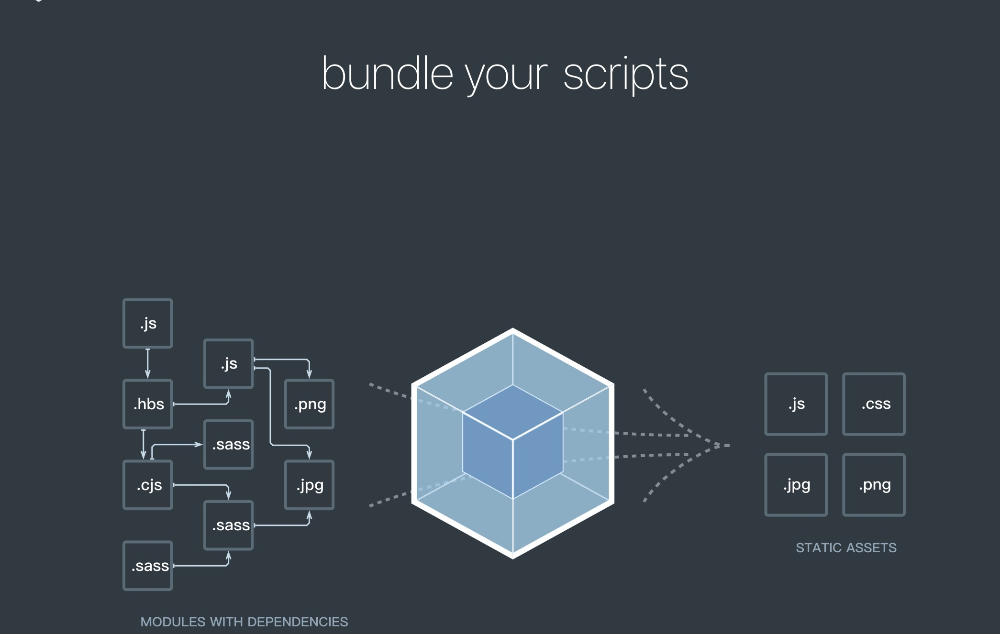

# Webpack 
>--- 第一节 ---  

1、什么是 Webpack  
  Webpack 本质上是一个现代 JavaScript 应用程序的静态模块打包器，在 Webpack 处理应用程序员时，它会递归地构建一个依赖关系图，其中包含应用程序需要的模块，然后将所有这些模块打包成一个或多个bundle。  

  

2、核心概念  
- Entry（入口）：  Webpack 构建的第一步从 Entry Point(入口起点)开始，指示 Webpack 应该使用哪些模块作为构建其内部依赖图的开始，默认值是：`./src/index.js`。Entry 可以有3种类型： string | object | array。最常用的 object 对象语法，扩展性最高，也常用于分离应用程序和第三方入口库。  
***
- Output（输出）：用于告诉 Webpack 在哪里输出创建的 bundles，以及如何命名这些文件。Output 是 object 类型，包含：
    - filename： 用于输出目录的文件名，输出多个文件时，使用占位符`[name].后缀名`,来确保每个文件具有唯一的名称；
    - path： 目标输出目录 path 的绝对路径，默认值是：`./dist`。
***
- Loader（模块转化器）：使 Webpack 能够处理非 JavaScript 文件。 Webpack 只能处理 JavaScript 和 JSON 文件，但是 Loader 可以将非 JavaScript 文件按照需求转化为模块（module）。Loader 是object类型，包含rules 属性，里面包含两个必须属性：  
  - test ： 用于标识出应该被对应的 loader 进行转换的某个或某些文件；
  - use ：表示应该使用哪个 loader 进行转换。
***
- Plugins (插件)：执行范围更广的任务，解决 Loader 无法事件的其它事。Plugins 是 Webpack 的支柱功能，可以优化打包文件、资源管理和环境变量注入等，它作用于整个构建过程。Plugins 是 array 类型，可以通过 new 操作符来创建实例达到多次使用同一个插件的目标。
>  Webpack 插件是一个具有 apply 属性的  JavaScript 对象， apply 会被  Webpack  compiler 调用，并且 compiler 对象可在整个编译周期访问。
***
- Mode(模式)：提供模式配置，告知  Webpack  使用相应模式的内置优化。接受字符串： development 、 production 、 none。其中：
  - development ： 会告知开启两个插件，用于在控制台打印是哪个模块发生了热更新；
  - production ：开启插件，默认代码压缩；
  - none ： 不开启任何优化参数。

